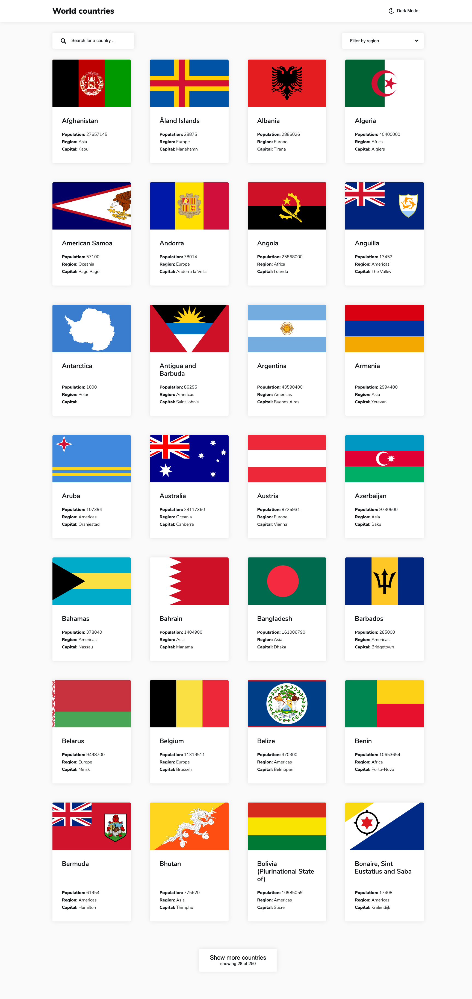

# Frontend Mentor - REST Countries API with color theme switcher solution

This is a solution to the [REST Countries API with color theme switcher challenge on Frontend Mentor](https://www.frontendmentor.io/challenges/rest-countries-api-with-color-theme-switcher-5cacc469fec04111f7b848ca). Frontend Mentor challenges help you improve your coding skills by building realistic projects.

## Table of contents

-   [Overview](#overview)
    -   [The challenge](#the-challenge)
    -   [Screenshot](#screenshot)
    -   [Links](#links)
-   [My process](#my-process)
    -   [Built with](#built-with)
    -   [What I learned](#what-i-learned)
-   [Author](#author)

## Overview

### The challenge

Users should be able to:

-   See all countries from the API on the homepage
-   Search for a country using an `input` field
-   Filter countries by region
-   Click on a country to see more detailed information on a separate page
-   Click through to the border countries on the detail page
-   Toggle the color scheme between light and dark mode _(optional)_

### Screenshot



### Links

-   [Solution URL - Github](https://github.com/nevenduranec/world-countries)
-   [Live Site URL](https://world-countries-iota.vercel.app/)

## My process

### Built with

-   CSS vars
-   Min/max for font size (`min(max(20px, 4vw), 22px);`)
-   PostCSS - [postcss-nested](https://github.com/postcss/postcss-nested), [postcss-pxtorem](https://github.com/cuth/postcss-pxtorem), [autoprefixer](https://github.com/postcss/autoprefixer)
-   Inline SVG icons from [Font Awesome](https://fontawesome.com/)
-   [Nuxt](https://nuxtjs.org/) - The Intuitive Vue Framework
-   [Color mode](https://color-mode.nuxtjs.org/) - for color mode switching

### What I learned

Animating text decoration with CSS Houdini

```css
@property --offset {
    syntax: '<length>';
    inherits: false;
    initial-value: 0;
}
```

Find out more about this on the [CSS in Real Life blog post](https://css-irl.info/animating-underlines/)

## Author

-   Website - [Neven Đuranec](https://digitalbits.hr/)
-   Frontend Mentor - [@nevenduranec](https://www.frontendmentor.io/profile/nevenduranec)
-   Twitter - [@nevenduranec](https://www.twitter.com/nevenduranec)
